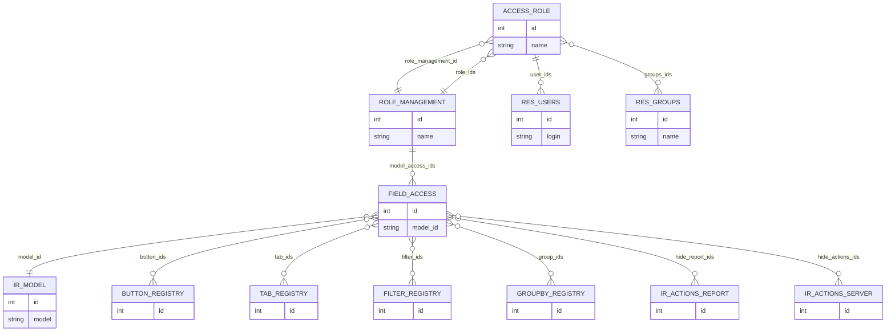

# ER Diagram — access_roles

```mermaid
erDiagram
    ACCESS_ROLE {
      int id
      string name
    }
    ROLE_MANAGEMENT {
      int id
      string name
    }
    FIELD_ACCESS {
      int id
      string model_id
    }
    RES_USERS {
      int id
      string login
    }
    RES_GROUPS {
      int id
      string name
    }
    IR_MODEL {
      int id
      string model
    }
    BUTTON_REGISTRY {
      int id
    }
    TAB_REGISTRY {
      int id
    }
    FILTER_REGISTRY {
      int id
    }
    GROUPBY_REGISTRY {
      int id
    }
    IR_ACTIONS_REPORT {
      int id
    }
    IR_ACTIONS_SERVER {
      int id
    }

    ACCESS_ROLE ||--o{ RES_USERS : "user_ids"
    ACCESS_ROLE }o--|| ROLE_MANAGEMENT : "role_management_id"
    ACCESS_ROLE }o--o{ RES_GROUPS : "groups_ids"
    ROLE_MANAGEMENT ||--o{ ACCESS_ROLE : "role_ids"
    ROLE_MANAGEMENT ||--o{ FIELD_ACCESS : "model_access_ids"
    FIELD_ACCESS }o--|| IR_MODEL : "model_id"
    FIELD_ACCESS }o--o{ BUTTON_REGISTRY : "button_ids"
    FIELD_ACCESS }o--o{ TAB_REGISTRY : "tab_ids"
    FIELD_ACCESS }o--o{ FILTER_REGISTRY : "filter_ids"
    FIELD_ACCESS }o--o{ GROUPBY_REGISTRY : "group_ids"
    FIELD_ACCESS }o--o{ IR_ACTIONS_REPORT : "hide_report_ids"
    FIELD_ACCESS }o--o{ IR_ACTIONS_SERVER : "hide_actions_ids"
```
