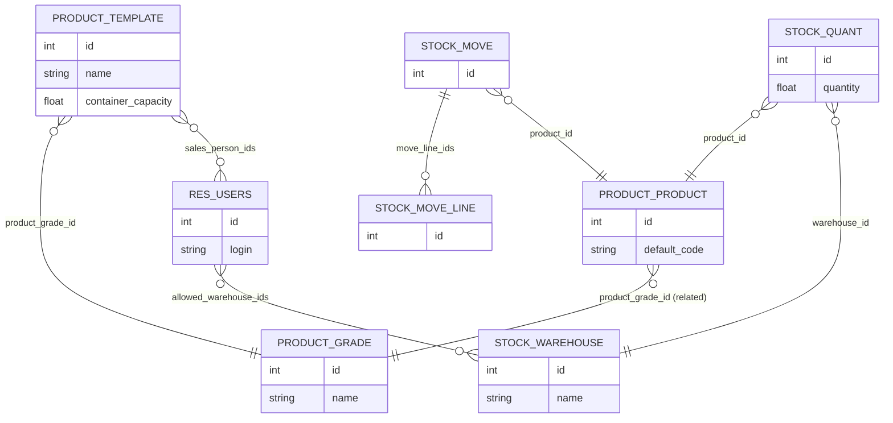

# ER Diagram — fjr_custom_stock

```mermaid
erDiagram
    PRODUCT_GRADE {
      int id
      string name
    }
    PRODUCT_TEMPLATE {
      int id
      string name
      float container_capacity
    }
    PRODUCT_PRODUCT {
      int id
      string default_code
    }
    STOCK_MOVE {
      int id
    }
    STOCK_MOVE_LINE {
      int id
    }
    STOCK_QUANT {
      int id
      float quantity
    }
    STOCK_WAREHOUSE {
      int id
      string name
    }
    RES_USERS {
      int id
      string login
    }

    PRODUCT_TEMPLATE }o--|| PRODUCT_GRADE : "product_grade_id"
    PRODUCT_TEMPLATE }o--o{ RES_USERS : "sales_person_ids"
    PRODUCT_PRODUCT }o--|| PRODUCT_GRADE : "product_grade_id (related)"
    STOCK_MOVE ||--o{ STOCK_MOVE_LINE : "move_line_ids"
    STOCK_QUANT }o--|| PRODUCT_PRODUCT : "product_id"
    STOCK_MOVE }o--|| PRODUCT_PRODUCT : "product_id"
    RES_USERS }o--o{ STOCK_WAREHOUSE : "allowed_warehouse_ids"
    STOCK_QUANT }o--|| STOCK_WAREHOUSE : "warehouse_id"
```
