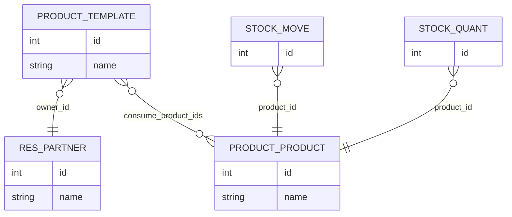

# ER Diagram — hd_inventory_custom

```mermaid
erDiagram
    PRODUCT_TEMPLATE {
      int id
      string name
    }
    RES_PARTNER {
      int id
      string name
    }
    PRODUCT_PRODUCT {
      int id
      string name
    }
    STOCK_MOVE {
      int id
    }
    STOCK_QUANT {
      int id
    }

    PRODUCT_TEMPLATE }o--|| RES_PARTNER : "owner_id"
    PRODUCT_TEMPLATE }o--o{ PRODUCT_PRODUCT : "consume_product_ids"
    STOCK_MOVE }o--|| PRODUCT_PRODUCT : "product_id"
    STOCK_QUANT }o--|| PRODUCT_PRODUCT : "product_id"
```
