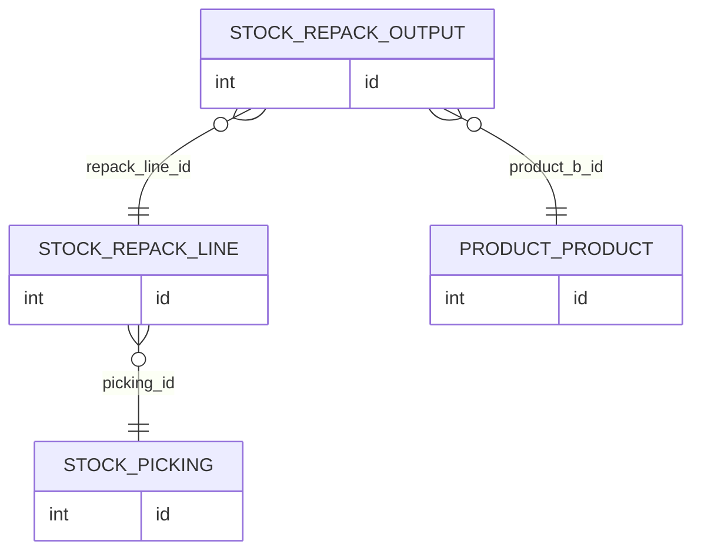

# ER Diagram — report-stock-delivery (repack)

```mermaid
erDiagram
    STOCK_REPACK_LINE {
      int id
    }
    STOCK_REPACK_OUTPUT {
      int id
    }
    STOCK_PICKING {
      int id
    }
    PRODUCT_PRODUCT {
      int id
    }

    STOCK_REPACK_LINE }o--|| STOCK_PICKING : "picking_id"
    STOCK_REPACK_OUTPUT }o--|| STOCK_REPACK_LINE : "repack_line_id"
    STOCK_REPACK_OUTPUT }o--|| PRODUCT_PRODUCT : "product_b_id"
```
